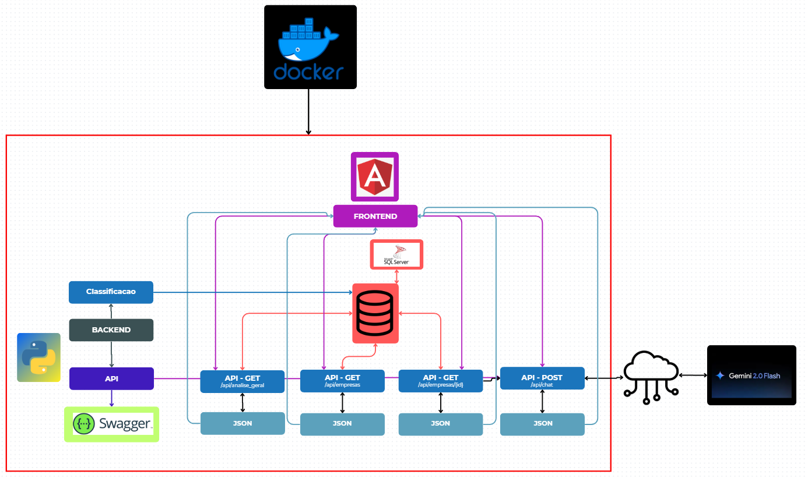
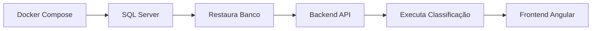
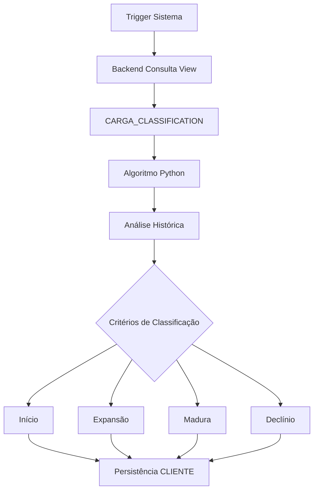
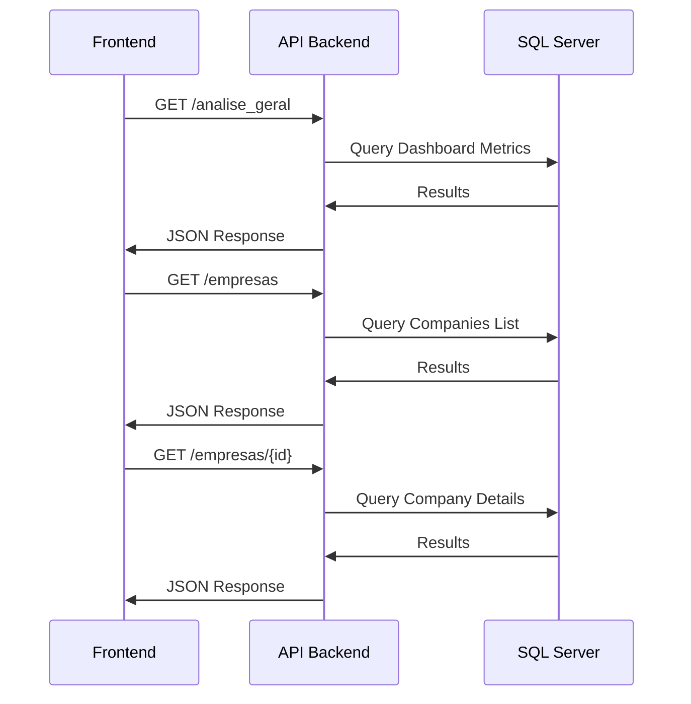
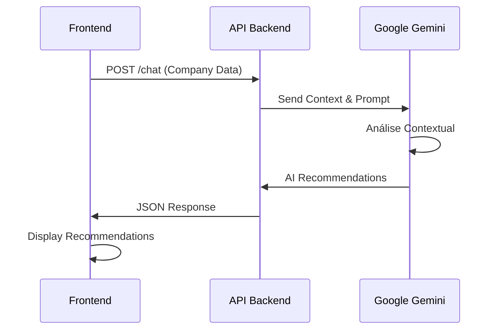
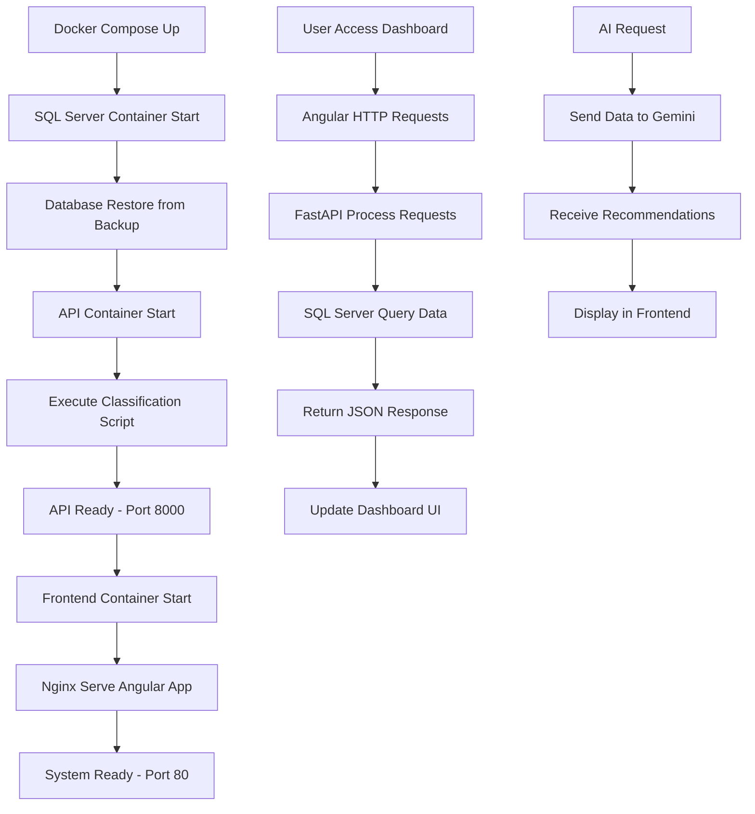

# 🏦 RedeFinance

**Sistema de Análise Financeira e Classificação de Empresas com Dashboard Inteligente**

RedeFinance é uma plataforma completa que combina análise de dados financeiros, classificação automatizada de empresas e inteligência artificial para oferecer insights bancários personalizados. O sistema é composto por uma API robusta, um sistema de classificação automatizada e um dashboard interativo para visualização de dados.

---

## 🎯 **Visão Geral do Projeto**

O RedeFinance foi desenvolvido para instituições financeiras que precisam:
- **Classificar automaticamente empresas** com base em seu desempenho financeiro
- **Visualizar dados corporativos** através de dashboards intuitivos  
- **Receber recomendações de produtos bancários** personalizadas via IA
- **Acompanhar métricas** de empresas individuais e análises gerais do portfólio

### 🏗️ **Arquitetura do Sistema**



### **📋 Detalhamento da Arquitetura**

O RedeFinance implementa uma **arquitetura de microsserviços containerizada** que opera em camadas bem definidas:

#### **🐳 Camada de Containerização (Docker)**
- **Orquestração**: Docker Compose gerencia todos os serviços
- **Isolamento**: Cada componente executa em container próprio
- **Escalabilidade**: Facilita deploy e manutenção independente

#### **🎨 Camada de Apresentação - Frontend (Angular)**
- **Framework**: Angular com TypeScript para interface moderna
- **Componentes**: Dashboard interativo com gráficos e métricas
- **Responsividade**: Interface adaptável para diferentes dispositivos
- **Servidor**: Nginx para servir arquivos estáticos otimizados

#### **🔧 Camada de Aplicação - Backend (Python)**
- **API Principal**: FastAPI com Swagger para documentação automática
- **Sistema de Classificação**: Algoritmo Python para categorização de empresas
- **Processamento**: Análise de dados financeiros em tempo real
- **Endpoints REST**: APIs estruturadas para comunicação frontend-backend

#### **💾 Camada de Dados - Banco SQL Server**
- **Banco Principal**: SQL Server containerizado com dados empresariais
- **Views Especializadas**: Consultas otimizadas para análises específicas
- **Procedures**: Lógica de negócio implementada no banco
- **Backup**: Sistema de restore automático com dados iniciais

#### **🤖 Camada de Inteligência - IA Externa**
- **Google Gemini**: Integração cloud para análise contextual
- **Processamento**: Recomendações personalizadas de produtos bancários
- **API Gateway**: Comunicação segura via internet

### **🔄 Fluxo de Dados e Operações**

#### **1️⃣ Inicialização do Sistema**


#### **2️⃣ Fluxo de Classificação Automática**


#### **3️⃣ Fluxo de Consulta de Dados (Frontend ↔ Backend)**


#### **4️⃣ Fluxo de Recomendação IA**


### **🏛️ Padrões Arquiteturais Implementados**

#### **📦 Microservices Pattern**
- **Serviço Frontend**: Interface do usuário isolada
- **Serviço API**: Lógica de negócio e endpoints
- **Serviço Banco**: Persistência de dados centralizada
- **Serviço Classificação**: Processamento específico

### **🌐 Integração e Comunicação entre Serviços**

#### **🔗 Mapeamento de Portas e Networking**
```yaml
# Docker Network: redefinance_default (bridge)
Frontend:  localhost:80    → nginx:80
API:       localhost:8000  → uvicorn:8000  
Database:  localhost:14330 → sqlserver:1433
```

#### **📡 Protocolos de Comunicação**
- **Frontend ↔ API**: HTTP/REST com JSON
- **API ↔ Database**: TCP/SQL via PyODBC 
- **API ↔ Gemini AI**: HTTPS/REST via Google SDK
- **Docker Services**: Internal DNS resolution

#### **🔐 Configuração de CORS e Segurança**
```python
# Domínios permitidos para comunicação frontend
allow_origins = [
    "http://localhost",      # Produção
    "http://localhost:80",   # Docker frontend  
    "http://localhost:4200"  # Desenvolvimento Angular local
]
```

#### **⚡ Otimizações de Performance**
- **Connection Pooling**: Reutilização de conexões com banco
- **Async Operations**: Processamento não-bloqueante no FastAPI
- **Caching**: Views materializadas para consultas frequentes
- **Lazy Loading**: Carregamento sob demanda no frontend

#### **🔄 Ciclo de Vida Completo do Sistema**



---

## 🚀 **Funcionalidades Principais**

### 📊 **Sistema de Classificação Automática**
O coração do RedeFinance é seu algoritmo de classificação que categoriza empresas em quatro perfis:

- **🌱 Início**: Empresas com menos de 5 anos de operação
- **📈 Expansão**: Saldo do último mês superior à média + 15% de margem
- **📉 Declínio**: Saldo do último mês inferior à média - 15% de margem  
- **⚖️ Madura**: Saldo dentro da faixa de estabilidade (média ± 15%)

**Critérios de Classificação:**
- Análise temporal de saldos mensais
- Cálculo de médias históricas com margem de tolerância
- Avaliação do tempo de mercado da empresa
- Dados de faturamento e relacionamentos bancários

### 🤖 **Inteligência Artificial Integrada**
- **Motor de IA**: Google Gemini para análise contextual
- **Recomendações Personalizadas**: Produtos bancários baseados no perfil da empresa
- **Análise Ponderada**: Sistema de pesos para diferentes métricas financeiras
- **Respostas Estruturadas**: com recomendações e justificativas

### 📈 **Dashboard Interativo**
- **Visão Geral**: Métricas consolidadas do portfólio de empresas
- **Análise Individual**: Detalhamento completo por CNPJ
- **Gráficos Dinâmicos**: Visualizações em tempo real (Chart.js)
- **Filtros**: Busca por nome e classificação

---

## 🛠️ **Stack Tecnológico Completo**

### **🐍 Backend & Processamento**
| Tecnologia | Função | Justificativa |
|------------|--------|---------------|
| **FastAPI** | Framework API | Performance superior, documentação automática, async/await nativo |
| **Python 3.12** | Runtime principal | Ecossistema ML/Data Science, sintaxe clara |
| **Pandas** | Análise de dados | Manipulação eficiente de datasets financeiros |
| **PyODBC** | Conectividade DB | Driver oficial Microsoft para SQL Server |
| **Uvicorn** | Servidor ASGI | Servidor de alta performance para FastAPI |
| **Pydantic** | Validação de dados | Type hints e validação automática de APIs |

### **🎨 Frontend & Interface**
| Tecnologia | Função | Justificativa |
|------------|--------|---------------|
| **Angular 18** | Framework SPA | Arquitetura robusta, TypeScript nativo |
| **TypeScript** | Linguagem principal | Type safety, melhor DX e manutenibilidade |
| **Chart.js** | Visualização de dados | Gráficos interativos e responsivos |
| **SCSS/Sass** | Estilização | CSS avançado com variáveis e mixins |
| **Angular Material** | Componentes UI | Design system consistente |
| **RxJS** | Programação reativa | Gerenciamento de estado assíncrono |

### **💾 Banco de Dados & Persistência**
| Tecnologia | Função | Justificativa |
|------------|--------|---------------|
| **SQL Server 2022** | SGBD principal | Robustez empresarial, performance para analytics |
| **Docker Volume** | Persistência | Dados mantidos entre restarts do container |
| **Views Materializadas** | Performance | Consultas pré-processadas para dashboards |
| **Stored Procedures** | Lógica de negócio | Processamento otimizado no banco |

### **🤖 Inteligência Artificial**
| Tecnologia | Função | Justificativa |
|------------|--------|---------------|
| **Google Gemini** | Motor de IA | Modelo LLM avançado para análise contextual |
| **Google AI SDK** | Integração | Cliente oficial para APIs do Google |
| **Prompt Engineering** | Otimização IA | Prompts especializados para recomendações bancárias |

### **🐳 DevOps & Infraestrutura**
| Tecnologia | Função | Justificativa |
|------------|--------|---------------|
| **Docker** | Containerização | Isolamento, portabilidade e consistência |
| **Docker Compose** | Orquestração | Gerenciamento multi-container simplificado |
| **Nginx** | Servidor web | Proxy reverso e servir arquivos estáticos |
| **Multi-stage Builds** | Otimização | Imagens Docker menores e mais seguras |

### **🔧 Ferramentas de Desenvolvimento**
| Tecnologia | Função | Justificativa |
|------------|--------|---------------|
| **Swagger/OpenAPI** | Documentação API | Documentação interativa automática |
| **Git** | Controle de versão | Padrão da indústria para versionamento |
| **Postman** | Teste de APIs | Validação e debugging de endpoints |

---

## 📚 **Documentação da API**

### **Base URL**: `http://localhost:8000/api`

### **🏢 Empresas** (`/empresas`)

#### `GET /empresas`
Retorna lista simplificada de todas as empresas.

**Response:**
```json
[
  {
    "nome": "CARREFOUR COMERCIO E INDUSTRIA LTDA",
    "cnpj": "CNPJ_00001",
    "classificacao": "Expansão",
    "cnae": "Extração de minério de ferro"
  }
]
```

#### `GET /empresas/{id}`
Retorna dados detalhados de uma empresa específica.

**Parameters:**
- `id` (string): CNPJ da empresa

**Response:**
```json
{
  "nome": "CARREFOUR COMERCIO E INDUSTRIA LTDA",
  "id": "CNPJ_00001",
  "saldo_total": 45678.90,
  "medLucro": 2405.46,
  "classificacao": "Expansão",
  "cnae": "Extração de minério de ferro",
  "saldos": [
    {
        "data": 2010-01,
        "saldo": "500.00"
    },
    {
        "data": 2010-02,
        "saldo": "500.00"
    }
  ],
  "relacionamentos": {
    "pagadores": [
        {
            "cnpj": "CNPJ_01929",
            "nome": "CNPJ_01929",
            "totalEnt": 0,
            "totalSai": 285241,
            "interacoes": 3
        }
    ],
    "recebedores": [
        {
            "cnpj": "CNPJ_01929",
            "nome": "CNPJ_01929",
            "totalEnt": 0,
            "totalSai": 285241,
            "interacoes": 3
        }
    ]
  }
}
```

### **📊 Análise Geral** (`/analise_geral`)

#### `GET /analise_geral`
Retorna métricas consolidadas do portfólio.

**Response:**
```json
{
  "total_empresas": 10000,
  "empresas_declinio": 2919,
  "qtdTipoTransacao": {
    "tipo": "PIX",
    "quantidade": 70000
  },
  "tipoTransacao": [
    {
      "tipo": "PIX",
      "valor_total": 398962
    },
    {
      "tipo": "BOLETO",
      "valor_total": 8643
    },
    {
      "tipo": "TED",
      "valor_total": 56390
    },
    {
      "tipo": "SISTEMICO",
      "valor_total": 27299
    }
  ],
  "classificacoes": [
    {
      "classificacao": "Expansão",
      "quantidade": 3085,
      "porcentagem": 30.85
    },
    {
      "classificacao": "Início",
      "quantidade": 2989,
      "porcentagem": 29.89
    },
    {
      "classificacao": "Declínio",
      "quantidade": 2919,
      "porcentagem": 29.19
    },
    {
      "classificacao": "Não Classificado",
      "quantidade": 1000,
      "porcentagem": 10
    },
    {
      "classificacao": "Madura",
      "quantidade": 7,
      "porcentagem": 0.07
    }
  ]
}
```

### **🤖 Chat IA** (`/chat`)

#### `POST /chat`
Solicita recomendações de produtos bancários baseadas em dados da empresa.

**Request Body:**
```json
{
  "json_object": {
        "nome": "CARREFOUR COMERCIO E INDUSTRIA LTDA",
        "id": "CNPJ_00001",
        "saldo_total": 45678.90,
        "medLucro": 2405.46,
        "classificacao": "Expansão",
        "cnae": "Extração de minério de ferro",
        "saldos": [
            {
                "data": 2010-01,
                "saldo": "500.00"
            },
            {
                "data": 2010-02,
                "saldo": "500.00"
            }
        ],
        "relacionamentos": {
            "pagadores": [
                {
                    "cnpj": "CNPJ_01929",
                    "nome": "CNPJ_01929",
                    "totalEnt": 0,
                    "totalSai": 285241,
                    "interacoes": 3
                }
            ],
            "recebedores": [
                {
                    "cnpj": "CNPJ_01929",
                    "nome": "CNPJ_01929",
                    "totalEnt": 0,
                    "totalSai": 285241,
                    "interacoes": 3
                }
            ]
        }
    }
}
```

**Response:**
```json
{
  "ReplyProducts": [
    {
      "product": "Crédito para Capital de Giro",
      "why": "Com base no crescimento de 15% nos últimos meses, esta linha de crédito pode potencializar a expansão da empresa..."
    },
    {
      "product": "Conta Empresarial Premium",
      "why": "O volume de transações indica necessidade de serviços bancários mais robustos..."
    }
  ]
}
```

---

## 🚀 **Como Executar o Projeto**

### **Pré-requisitos**
- Docker e Docker Compose instalados
- É necessário gerar a própia variável de ambiente `GEMINI_API_KEY` 

### **Execução Completa**
```bash
# Execute todos os serviços
docker-compose up --build

# Aguarde todos os containers subirem:
# - API: http://localhost:8000
# - Frontend: http://localhost:80
# - Banco SQL: localhost:14330
```

### **Execução Individual dos Serviços**

#### **Backend/API**
```bash
cd API
pip install -r requirements.txt
uvicorn api:app --reload --host 0.0.0.0 --port 8000
```

#### **Sistema de Classificação**
```bash
cd API
python -m classification.main
```

#### **Frontend**
```bash
cd frontend
npm install
ng serve -o
```

---

## ⚙️ **Sistema de Classificação Detalhado**

### **Fluxo de Processamento**
1. **Coleta de Dados**: Extração da view `CARGA_CLASSIFICATION`
2. **Análise Temporal**: Cálculo de médias históricas por empresa
3. **Aplicação de Regras**: Classificação baseada em critérios definidos
4. **Atualização**: Persistência das classificações no banco de dados

### **Métricas Utilizadas**
- **Saldo Total**: Liquidez acumulada da empresa
- **Saldo Mensal**: Variação recente de performance
- **Data de Abertura**: Tempo de mercado da empresa
- **Histórico de Transações**: Padrões de movimentação financeira

### **Configuração de Execução**
- **Horário**: Por padrão, executa entre 00:00 e 02:59
- **Frequência**: Configurável conforme necessidade do negócio

---

### **Portas Utilizadas**
- **8000**: API FastAPI
- **80**: Frontend Angular
- **14330**: SQL Server (mapeada para 1433 interno)
